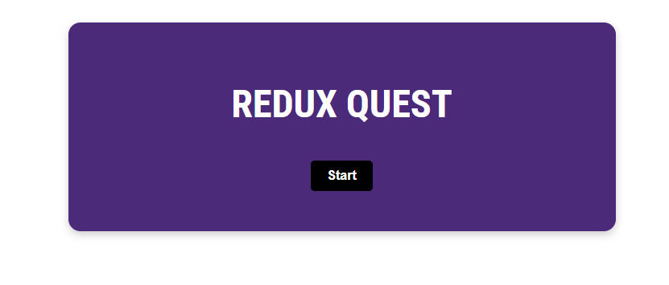
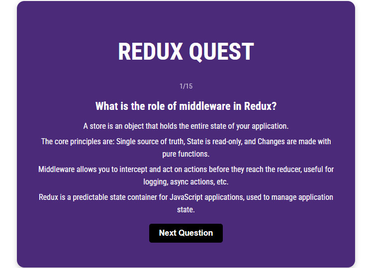
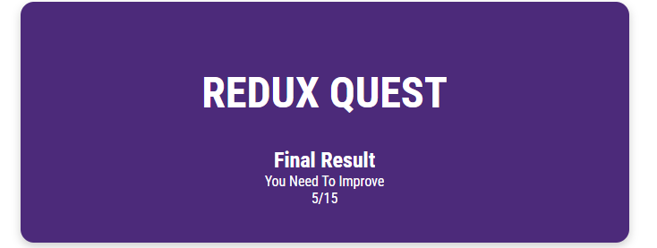

# Redux Quest App

## Project Description

Redux Quest is a React-based web application designed to enhance understanding and proficiency in using React and Redux, particularly focusing on the Redux Toolkit. This project showcases an interactive quiz application where users answer questions and receive real-time feedback. The app tracks user progress, displays a question counter, and presents the final score upon completion.

---

## Features

- **Interactive Quiz**: Choose from four different answers for each question.
- **Real-Time Feedback**: Displays whether the selected answer is correct or incorrect.
- **Progress Tracking**: A counter shows how many questions remain.
- **Final Score Display**: At the end of the quiz, your total score is displayed.

---

## Technologies Used

This project utilizes modern tools and libraries to create a robust and efficient application:

- **React**: Frontend framework for building user interfaces.
- **Redux**: State management library for predictable state handling.
- **Redux Toolkit**: Simplifies Redux development with powerful utilities.
- **Vite**: Fast and efficient build tool for modern web projects.
- **CSS Modules**: For modular and scoped styling of components.

---

## Getting Started

Follow these steps to set up and run the project locally:

1. Clone the repository:

   ```bash
   git clone <repository-url>
   ```

2. Navigate to the project directory:

   ```bash
   cd redux-quest-app
   ```

3. Install dependencies:

   ```bash
   npm install
   ```

4. Start the development server:

   ```bash
   npm run dev
   ```

5. Open your browser and navigate to `http://localhost:5173` to view the app.

---

## How to Play

1. Launch the app.
2. Answer each question by selecting one of the four options provided.
3. The app will instantly notify you if your answer is correct or incorrect.
4. Track your progress with the question counter.
5. After answering all questions, view your total score on the final screen.

---

## Project Goals

This project was developed to:

- Deepen understanding of React and Redux concepts.
- Gain hands-on experience with the Redux Toolkit.
- Build an interactive and dynamic web application.
- Experiment with CSS Modules for modular styling.

---

## Preview







### Information

For any questions or feedback, feel free to reach out:

- GitHub: [GabZzL](https://github.com/GabZzL)
- Email: armandogabrieljl@gmail.com
